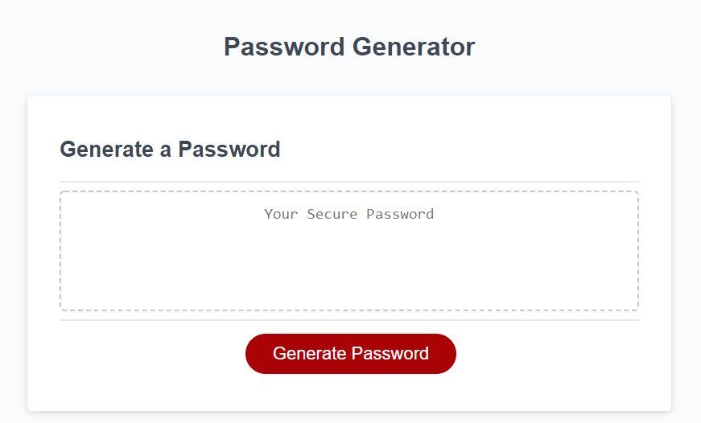
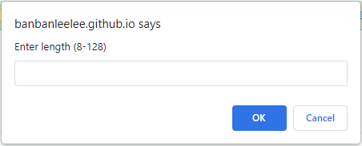
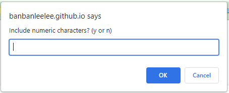
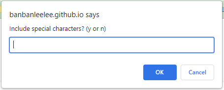
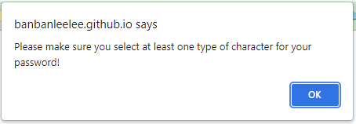
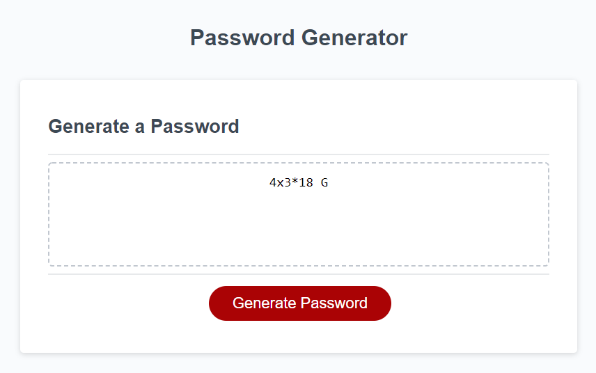
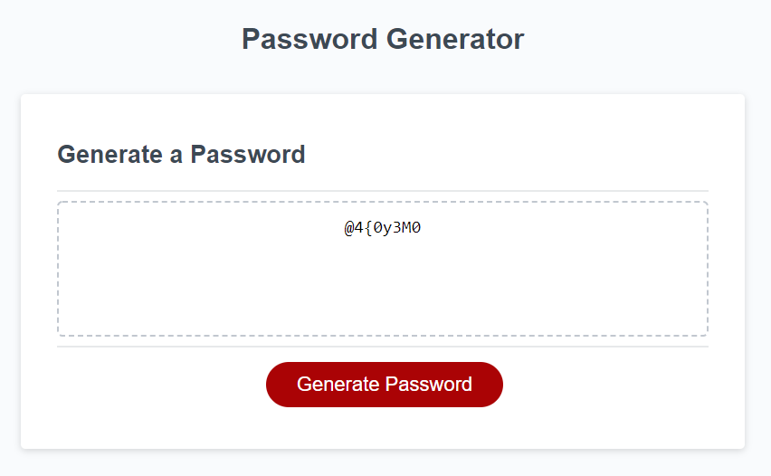

# Random Password Generator

## Overview
This project is a random password generator. User can choose a length from 8 to 128, and include 1 to 4 different characters, including lowercase, uppercase, numeric, and special ones.

## Technology Used
HTML, CSS, JavaScript

## User Journey
```md
The Password Generator application displays a red button to "Generate Password."
```



```md
When a user clicks the "Generate Password" button, they will be prompted to make a series of decisions. 
```







```md
If the user did not answer in the acceptable format or value, the prompt will show up again for re-enter.
```



```md
Then the user will be able to see the password generate in the box.
```



```md
The user can also click the "Generate Password" button again to get another password that fulfills his/her criteria.
```



## GitHub Repository
https://github.com/banbanleelee/RandomPasswordGenerator

## Deployed Application
https://banbanleelee.github.io/RandomPasswordGenerator/

## License
The MIT License (MIT)

Copyright (c) 2021 Yixuan Sally Zhang

Permission is hereby granted, free of charge, to any person obtaining a copy of this software and associated documentation files (the "Software"), to deal in the Software without restriction, including without limitation the rights to use, copy, modify, merge, publish, distribute, sublicense, and/or sell copies of the Software, and to permit persons to whom the Software is furnished to do so, subject to the following conditions:

The above copyright notice and this permission notice shall be included in all copies or substantial portions of the Software.

THE SOFTWARE IS PROVIDED "AS IS", WITHOUT WARRANTY OF ANY KIND, EXPRESS OR IMPLIED, INCLUDING BUT NOT LIMITED TO THE WARRANTIES OF MERCHANTABILITY, FITNESS FOR A PARTICULAR PURPOSE AND NONINFRINGEMENT. IN NO EVENT SHALL THE AUTHORS OR COPYRIGHT HOLDERS BE LIABLE FOR ANY CLAIM, DAMAGES OR OTHER LIABILITY, WHETHER IN AN ACTION OF CONTRACT, TORT OR OTHERWISE, ARISING FROM, OUT OF OR IN CONNECTION WITH THE SOFTWARE OR THE USE OR OTHER DEALINGS IN THE SOFTWARE.
